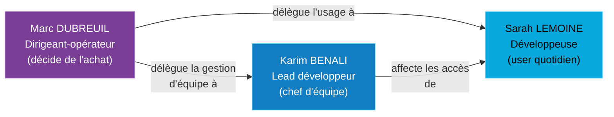

# 03 — Persona & rôles utilisateurs

> **Audience** : jury, équipe produit · **Source slides** : 05, 06, A02

---

## Pourquoi un persona ?

Le POC est conçu pour une **personne**, pas pour une fiche marketing. Quand on hésite sur un choix produit, on se demande : *« Qu'est-ce que Marc en penserait ? »*. La doc utilisateur ([documentation utilisateur](../utilisateur/README.md)) est écrite pour lui.

---

## 1. Marc DUBREUIL — l'acheteur

| Attribut | Valeur |
|---|---|
| **Rôle** | Dirigeant-opérateur de TPE |
| **Âge** | 41 ans |
| **Localisation** | Lyon |
| **Structure** | Co-fondateur de l'agence web *Atelier Numérique* — 12 personnes |
| **Stack actuelle** | 10 SaaS différents, 850 € / mois cumulés |
| **Profil tech** | École de commerce + autodidacte tech ; pas de DSI, pas de sysadmin, **il fait tout lui-même** |

### Son histoire

Marc dirige son agence depuis 8 ans. Il s'est formé en autodidacte sur le tech minimum vital. Il gère lui-même les comptes Google Workspace, le Bitwarden d'équipe, le serveur Dropbox, les factures. Il s'en sort, mais c'est **toujours le soir, toujours en stress, jamais bien**.

### Ses buts

- **Faire tourner l'agence sereinement** — ce qui veut dire arrêter de se réveiller en pleine nuit en se demandant si Sophie a encore accès à Dropbox
- **Reprendre la main sur ses SaaS** — comprendre exactement qui a accès à quoi
- **Sécuriser arrivées et départs** — onboarding propre, offboarding total et auditable

### Ses irritants

- **Onboarding = demi-journée perdue** : créer 10 comptes différents pour un nouveau dev
- **Offboarding raté** : l'ex-alternant a gardé l'accès au coffre Bitwarden **2 mois** après son départ (vrai !)
- **Pas le temps d'apprendre Keycloak** : ce qui veut dire **pas le temps d'apprendre AUCUN outil complexe**
- **Factures SaaS qui montent** : 10 SaaS × 8,50 €/user/mois × 10 employés = 850 €/mois en croissance

### Ses leviers d'achat

- **Souveraineté numérique** (DORA, NIS2) : *"je peux le dire à mes clients, c'est un argument commercial"*
- **Coût SaaS cumulé qui grimpe** : Galaxis pourrait diviser par 3 sa note
- **Témoignages de pairs dirigeants** : effet de réseau dans la communauté des gérants de TPE

### Sa citation iconique

> *« J'aimerais un truc simple, où je crée une fois, je révoque une fois, et je sais en permanence ce qui se passe. Et si en plus c'est français et open source, je signe demain. »*
> — Marc, propos imaginé (mais inspiré de 8 conversations réelles)

### Implications produit

- ✅ Pas de jargon technique dans l'UI ni la doc utilisateur
- ✅ L'admin Keycloak doit être **caché derrière des écrans simples** (à terme : page admin Galaxis maison, OUT scope POC)
- ✅ L'offboarding = **un seul clic** (revoke session + désactivation user)
- ✅ Le journal d'audit doit être **lisible** par Marc, pas par un dev

---

## 2. Sarah LEMOINE — l'utilisatrice quotidienne

| Attribut | Valeur |
|---|---|
| **Rôle** | Développeuse web |
| **Âge** | 28 ans |
| **Contexte** | Une des dev de l'agence de Marc |

### Ce qu'elle attend de Galaxis

- **Se connecter une fois le matin** (SSO) et ne plus y penser
- **Accéder à tous ses outils sans friction**
- **Trouver ses credentials immédiatement** (Vaultwarden)

### Utilisation type (slide 6)

> *« Ouvre Galaxis à 9h → accède à Vaultwarden, Nextcloud et ses outils dev en un clic. »*

### Implications produit

- ✅ Le dashboard montre toutes les briques en un coup d'œil
- ✅ Le login est **rapide** et **mémoire courte** (`rememberMe: true` dans Keycloak)
- ✅ Pas de notion de "rôle admin" dans l'UI Sarah — elle voit juste ses outils

---

## 3. Karim BENALI — le lead développeur

| Attribut | Valeur |
|---|---|
| **Rôle** | Lead développeur, chef d'équipe |
| **Âge** | 35 ans |
| **Contexte** | Chef de projet sur l'agence — gère 4 freelances en plus |

### Ce qu'il attend de Galaxis

- **Constituer ses équipes projet en autonomie** (sans demander à Marc)
- **Vue sur les accès actifs de son équipe**
- **Révoquer un freelance** sans passer par le boss

### Utilisation type (slide 6)

> *« Lance un nouveau projet → crée son groupe d'équipe et affecte les accès en 30 secondes. »*

### Implications produit

- ✅ Notion de **groupes** dans Keycloak (rôles métier mappés en claims)
- ⚠️ **L'admin Karim** est OUT scope POC (slide 7 : pas de "page admin Galaxis"), mais la fondation Keycloak permet déjà la gestion par groupe
- 🎯 v2 : page admin maison qui exposé un sous-ensemble des actions Keycloak avec UI Karim-friendly

---

## 4. Hiérarchie persona ↔ rôles

---

## 5. Tableau récapitulatif des rôles

| Persona | Rôle Galaxis (cible) | Permissions | POC |
|---|---|---|---|
| **Marc** | Owner / admin global | Tout : provisioning users, briques, audit complet, facturation | manuel via console Keycloak |
| **Karim** | Team lead (groupe) | Manage users de son groupe, voir l'audit de son groupe | OUT scope POC, fondations posées |
| **Sarah** | User standard | Login, dashboard, accès briques | ✅ POC |

---

## 6. Personas LLM scénarisés (méthode complémentaire — slide A02)

En complément des consultations terrain, des **personas simulés via LLM** ont été utilisés pour stress-tester les parcours :

| Persona simulé | Usage |
|---|---|
| Dirigeant TPE type *Marc* | parcours d'onboarding produit, friction UX |
| DSI / Responsable IT PME 20-50 | parcours d'évaluation comparative (vs Auth0, JumpCloud) |
| Employé utilisateur type *Sarah* | login matinal, oubli mot de passe |
| Chef d'équipe type *Karim* | création d'équipe projet, révocation freelance |

Cette méthode complète mais **ne remplace pas** les vrais témoignages (cf. slide A02).

---

## Liens internes

- Contexte marché : [01-contexte-marche.md](./01-contexte-marche.md)
- Périmètre IN/OUT : [05-perimetre-decisions.md](./05-perimetre-decisions.md)
- Doc utilisateur (pour Marc) : [../utilisateur/README.md](../utilisateur/README.md)
