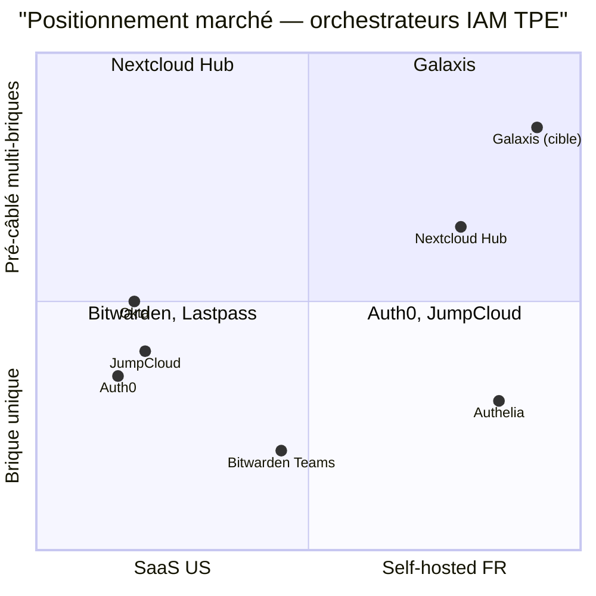
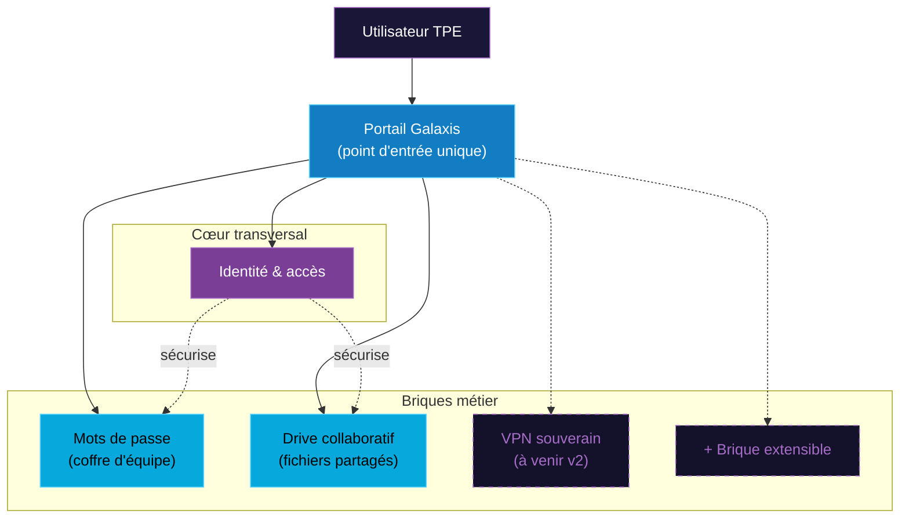

# 04 — Proposition de valeur

> **Audience** : jury, investisseur, équipe commerciale future · **Source slides** : 03, 09

---

## Pitch (45 secondes — slide 03)

> *Pour les TPE françaises qui veulent reprendre la main sur leurs outils numériques, **Galaxis est un orchestrateur souverain** qui déploie un écosystème open source pré-câblé et accessible via un seul écran d'administration, visant à offrir **la souveraineté numérique**.*

---

## Value Proposition Canvas

### Du côté du client (Marc, dirigeant de TPE)

| Jobs to be done | Pains | Gains attendus |
|---|---|---|
| Gérer les comptes de mon équipe sans y passer mes soirées | Onboarding = demi-journée perdue | Onboarding < 5 min |
| Savoir qui a accès à quoi | Offboarding raté, ex-employé garde l'accès | Offboarding 1 clic, audit prouvable |
| Réduire la facture SaaS | 850 € / mois et ça grimpe | < 50 € / mois |
| Être conforme RGPD/DORA/NIS2 sans embaucher un juriste | Audit de conformité = panique | Donnée chez moi, fournisseurs européens |
| Ne pas dépendre des US | Sentiment de perte de souveraineté | Open source self-hosted |

### Du côté du produit (Galaxis)

| Pain relievers | Gain creators |
|---|---|
| Un seul login pour toutes les briques (SSO) | Le portail unique donne une vue d'ensemble en 1 écran |
| Provisioning centralisé | Brique extensible : ajouter un service = ajouter une carte |
| Open source 100 % audité | Communauté qui contribue, pas de vendor lock-in |
| Self-hosted | La donnée ne quitte pas la juridiction choisie |
| Déploiement scripté (Ansible) | Mise en route < 1h |

---

## Différenciation

Galaxis occupe **le quadrant désert** : self-hosted FR **ET** pré-câblé multi-briques. Aucun acteur ne couvre ces deux axes simultanément aujourd'hui.

---

## Modèle économique envisagé (post-POC)

| Offre | Cible | Prix / mois | Inclus |
|---|---|---|---|
| **Galaxis Self-Host (gratuit)** | Bricoleurs autonomes | 0 € | Code open source, doc complète, communauté |
| **Galaxis Managed Starter** | TPE 1-10 personnes | 49 € | VM managée par AstroTechs en France, support email |
| **Galaxis Managed Pro** | TPE/PE 10-50 | 149 € | + sauvegardes auto, SLA 99,5%, support prioritaire |
| **Galaxis Cloud Sovereign** | PME / secteur sensible | sur mesure | déploiement AWS eu-west-3 dédié, monitoring 24/7 |

**Hypothèses** :
- Coût d'infra par instance < 15 €/mois (VPS OVH ou Scaleway)
- Marge brute Starter : ~70 %
- Acquisition par bouche-à-oreille TPE + partenariats DSI conseil

---

## Argumentaire de vente (3 messages)

### 1. *« Vous gardez la main »*

Tout est self-hosted (ou hébergé en France chez nous). Vous décidez qui voit la donnée. Aucun fournisseur tiers entre vos mains et vos employés.

### 2. *« Vous économisez vraiment »*

Un dirigeant qui paie 850 €/mois en SaaS éparpillés peut passer à 49 €/mois Galaxis Managed Starter. Économie : **~9 600 €/an**. Le ROI est immédiat.

### 3. *« Vous êtes conforme par défaut »*

Donnée chez vous, fournisseurs européens, audit log natif. Vous pouvez répondre à un audit DORA en quelques clics, pas en deux semaines.

---

## Architecture fonctionnelle (vision produit)

> **Principe** : *Ajouter une brique = ajouter une carte dans le portail.* C'est ce que veut dire « orchestrateur ».

---

## Promesses à NE PAS faire (anti-positionnement)

Pour rester crédibles, on **ne promet pas** :

- "Remplace Slack" → Galaxis n'a pas de messagerie temps réel (et n'en aura pas dans la v1)
- "Remplace votre CRM" → ce n'est pas la promesse
- "100 % de conformité automatique" → la conformité reste de la responsabilité du client
- "Performance equivalente à Auth0" → Auth0 a 200 personnes en SRE, Galaxis non
- "Migration silencieuse de vos SaaS" → on aide, on n'enchante pas

Honnêteté = crédibilité = vente long terme.

---

## Liens internes

- Contexte marché : [01-contexte-marche.md](./01-contexte-marche.md)
- Persona : [03-persona-roles.md](./03-persona-roles.md)
- Roadmap : [09-roadmap.md](./09-roadmap.md)
