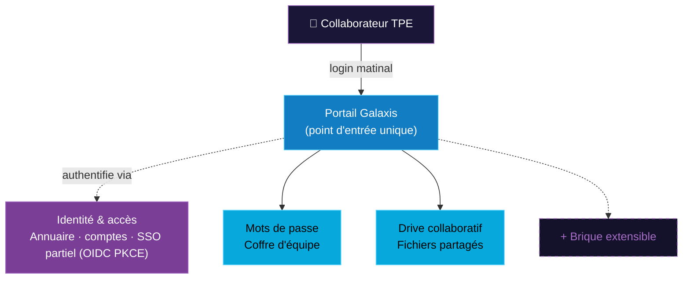
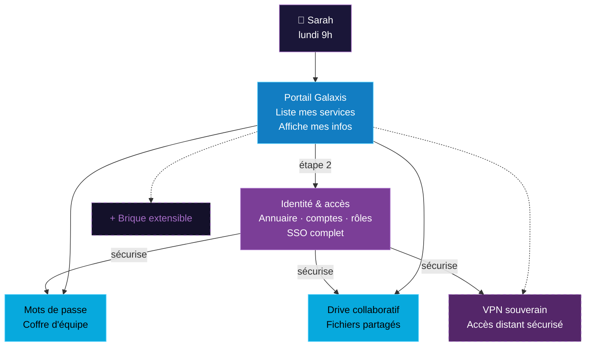
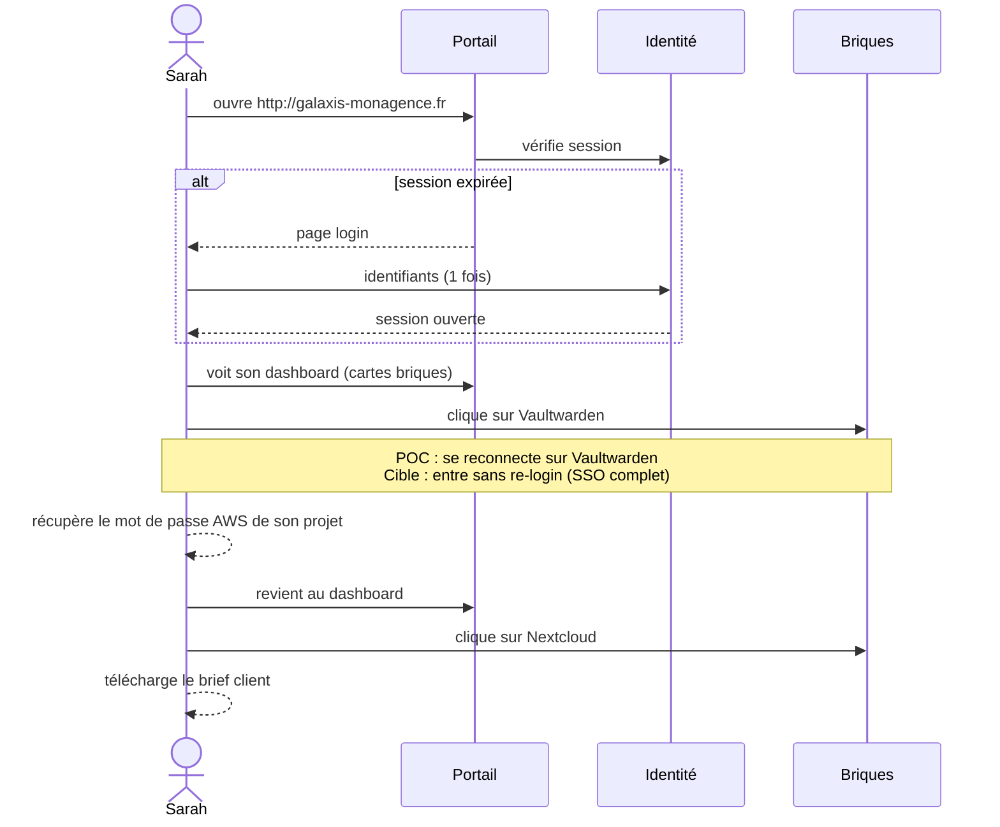

# 06 — Architecture fonctionnelle

> **Audience** : jury, équipe produit · **Source slides** : 08, 09

Ce chapitre décrit l'architecture **vue côté usage** (ce que Sarah expérimente), pas l'architecture technique (vue côté code, voir [doc technique 01](../technique/01-architecture-poc.md)).

---

## 1. Vue POC actuel (slide 08)

### Légende

- **Portail Galaxis** : point d'entrée unique de l'utilisateur. C'est l'écran qu'on ouvre le matin.
- **Identité & accès** : la brique transversale. Annuaire utilisateurs, gestion des comptes. SSO opérationnel **du portail au backend** (OIDC + PKCE). SSO bout-en-bout vers les briques métier = OUT scope POC.
- **Mots de passe** : Vaultwarden — coffre-fort d'équipe.
- **Drive collaboratif** : Nextcloud — fichiers et dossiers partagés.
- **+ Brique extensible** : placeholder visuel. Sa présence rappelle le principe : *ajouter une brique = ajouter une carte*. Pas implémentée en POC.

---

## 2. Vue cible (slide 09 — ce que ça deviendra)

### Ce qui change entre POC et cible

| Élément | POC | Cible |
|---|---|---|
| SSO | du portail vers le backend seulement | **bout en bout** : Sarah se connecte une fois, accède à tout sans re-login sur Vaultwarden/Nextcloud |
| VPN souverain | absent | brique métier ajoutée |
| Rôles dans l'annuaire | basique (default-roles) | groupes et rôles fins par projet (Karim peut gérer son équipe) |
| Provisioning | manuel via console | SCIM (synchronisation auto depuis annuaire RH) |
| MFA | non | TOTP + WebAuthn |

---

## 3. Le principe directeur — "orchestrateur"

> *Ajouter une brique = ajouter une carte dans le portail.*

C'est ce que veut dire **« orchestrateur »** dans le nom Galaxis. L'utilisateur ne change pas son geste : il ouvre le portail, il voit ses briques. L'admin Marc peut activer ou désactiver une brique sans former personne.

Cette extensibilité est ce qui permet d'imaginer demain :
- Ajout d'un **Wiki** (ex : Outline)
- Ajout d'une **messagerie** (ex : Element/Matrix)
- Ajout d'un **gestionnaire de projet** (ex : Vikunja)
- Ajout d'un **outil d'IA en interne** (ex : Open WebUI + Ollama)

Chaque brique = une carte. C'est sobre, c'est lisible, c'est prévisible.

---

## 4. Parcours utilisateur typique (Sarah, lundi 9h)

Temps total typique : **< 30 secondes** pour accéder à n'importe quelle ressource.

---

## 5. Composants fonctionnels (mapping technique)

| Composant fonctionnel | Brique technique POC | Brique technique cible |
|---|---|---|
| Identité & accès | Keycloak 25 | Keycloak 25+ sur ECS Fargate |
| Mots de passe | Vaultwarden | Vaultwarden + fédération OIDC |
| Drive collaboratif | Nextcloud 30 | Nextcloud + fédération OIDC + EFS |
| VPN souverain | (absent) | WireGuard ou OpenVPN + intégration claims |
| Brique extensible | placeholder | bus d'événements + plugin system |
| Portail | React 18 | React 18 + page admin |
| Audit | table Postgres + endpoint API | + CloudWatch Logs + dashboard Grafana |

---

## 6. Justification de la sélection de briques

Pourquoi **Keycloak + Vaultwarden + Nextcloud** et pas un autre trio ?

- **Maturité** : trois projets installés en production dans des milliers d'organisations européennes
- **Standards** : OIDC (Keycloak), API Bitwarden (Vaultwarden), WebDAV (Nextcloud) → interopérabilité
- **Communauté** : grosse documentation, écosystème de tutos en français
- **Empreinte** : ces trois briques tournent à l'aise sur une VM 2 vCPU / 4 GB RAM
- **Licences** : Apache 2.0 / AGPL — compatibles avec un modèle commercial managed services

Le trio **passwords + drive + VPN** correspond aux 3 services métier centraux d'une TPE moderne (validés dès la doc cadrage initiale Galaxis).

---

## 7. Évolutivité — pourquoi le portail est-il extensible ?

Le portail est juste un **catalogue de cartes**. Ajouter une brique consiste à :

1. Déployer la brique en conteneur (compose ou ECS task)
2. Configurer Caddy pour la router sur `/nouveau-service/`
3. Ajouter une entrée dans le dashboard React (juste un objet TypeScript)
4. (Si fédération OIDC) configurer Keycloak comme IdP de la brique

Pas de couplage fort. Pas de schema de DB partagé. C'est **délibérément simple**.

---

## Liens internes

- Vue technique : [../technique/01-architecture-poc.md](../technique/01-architecture-poc.md)
- Vue cible AWS : [../technique/02-architecture-cible.md](../technique/02-architecture-cible.md)
- Roadmap d'extension : [09-roadmap.md](./09-roadmap.md)
