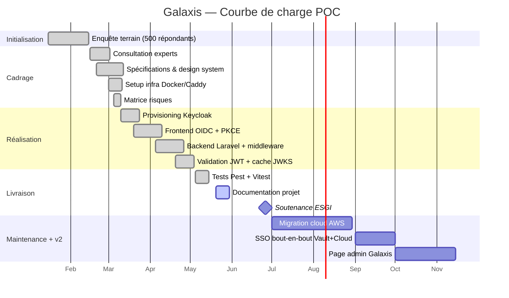

# 07 — Gestion de projet

> **Audience** : jury, encadrant ESGI · **Source slides** : 03 (courbe de charge), 04 (kanban annexe)

---

## Méthode

**Mode mono-équipier** (Lucas tout seul) ⇒ pas de Scrum, pas de tickets formels Jira. Plutôt :

- **Kanban personnel** sur Github Projects (ou équivalent local) — 5 colonnes : *Backlog · In progress · Review · Done · Out scope*
- **Cycle court** : 1 journée = 1 incrément utilisable ou 1 doc validée
- **Pas de daily** mais une **rétro hebdo** écrite (note privée)
- **Roadmap macro** validée avec l'encadrant ESGI à chaque jalon

L'objectif n'était pas la cérémonie, mais **l'auto-discipline** : tenir les engagements, ne pas glisser, livrer.

---

## Phasage (5 phases, ~ 6 mois — slide 04)

| Phase | Période | Sprints | Issues principales | Statut |
|---|---|---|---|---|
| **1 — Initialisation** | Janv–Fév 2026 | 1 | GLX-01 Enquête terrain (500 répondants — +2 sem.) | ajusté ✅ |
| **2 — Cadrage** | Fév–Mars 2026 | 4 | GLX-02 Consultation experts (+1 sem.) · GLX-03 Design system · GLX-04 Setup infra Docker/Caddy · GLX-04b Matrice des 8 risques | done ✅ |
| **3 — Réalisation** | Mars–Mai 2026 | 4 | GLX-05 Provisioning Keycloak · GLX-06 Frontend OIDC+PKCE · GLX-07 Backend Keycloak · GLX-08 Validation JWT + cache JWKS | done ✅ |
| **4 — Livraison** | Juin 2026 | 3 | GLX-09 Tests Pest · GLX-10 Doc projet · GLX-11 Soutenance 26 juin | en cours / à venir |
| **5 — Maintenance + v2** | Juil–Déc 2026 | 5 | GLX-12 Migration AWS · GLX-13 SSO Vault+Cloud · GLX-14 Page admin · GLX-15 Module audit · GLX-16 Tests intégration | to do |

---

## Courbe de charge (slide 03 — synthèse)

---

## Charge réelle estimée (synthèse)

| Phase | Charge brute | Effort hors temps de travail |
|---|---|---|
| Initialisation | ~30 j-h | analyse enquête + synthèse |
| Cadrage | ~20 j-h | choix stack, archi, DA |
| Réalisation | ~45 j-h | dev front + back + infra |
| Livraison | ~25 j-h | tests, docs, prépa soutenance |
| **Total POC** | **~120 j-h** | étalés sur 6 mois civils |

Soit ~4-5h/jour ouvré en moyenne. Compatible avec une vie étudiante + missions ponctuelles AstroTechs.

---

## Matrice des risques (issue cadrage — slide implicite)

| Risque | Probabilité | Impact | Mitigation |
|---|:---:|:---:|---|
| Bug bloquant dans Keycloak v25 | F | É | Pinning version, fallback v24 documenté |
| Mauvaise compréhension PKCE | F | É | Doc spécifique chapitre 07 technique, tests d'intégration |
| Démo qui plante le jour J | F | É | `make demo` répété 10 fois, plan B (vidéo de démo enregistrée) |
| Glissement planning | M | É | Périmètre réduit à 2 briques métier + features critiques only |
| Frontend OIDC instable | F | É | Choix `oidc-client-ts` (maintenu, type-safe) plutôt que rouler à la main |
| Réseau démo HS pendant la soutenance | F | É | Démo en local sur la VM portable, pas de dépendance internet |
| Conflit DA entre slides et POC | F | M | Extraction CSS variables des slides, tokens TS unifiés |
| Doc bâclée à la dernière minute | M | É | Doc rédigée pendant la phase 4, pas après |

P = Probabilité (F faible, M moyenne, É élevée) · I = Impact (idem) · 8 risques au total.

---

## Outils utilisés

| Catégorie | Outil | Pourquoi |
|---|---|---|
| Repo | Git (self-hosted ou GitHub) | standard |
| IDE | VS Code | extensions PHP + TS bonnes |
| Diagrammes | Mermaid en Markdown | versionnable, sans outil externe |
| Notes / kanban | Notion + GitHub Issues | mix perso + partage encadrant |
| Brainstorm DA | Figma | maquettes initiales, jamais pixel-perfect |
| Slides soutenance | HTML/CSS pur (pas PowerPoint) | contrôle total de la DA, animation et code partagent les mêmes tokens |
| Doc PDF unifiée | pandoc (optionnel) | conversion MD → PDF si dispo |

---

## Ajustements en cours de route

| Phase | Ajustement | Raison |
|---|---|---|
| 1 | Enquête prolongée +2 semaines | meilleur taux de réponse en relançant 2 fois |
| 2 | Consultation experts +1 semaine | retours techniques nuancés à digérer |
| 2 | Décision TLS POC → HTTP+SSH | feedback démo : "le jury va pas importer un CA" |
| 3 | Choix `oidc-client-ts` au lieu de coder PKCE à la main | gain de temps 3 jours, baisse du risque |
| 3 | Cache JWKS en Redis au lieu d'un cache fichier | cohérent avec le reste, mutualisé pour les sessions |
| 4 | Doc rédigée AVANT la finalisation des tests | éviter le bâclage |

---

## Bilan méthodologique

### Ce qui a bien marché

- **Cadrage strict** : la matrice IN/OUT de la slide 7 a évité de partir dans tous les sens
- **Décisions tracées** : `EXPLORATION.md` + ce chapitre = quiconque reprend le projet sait pourquoi tel choix
- **Doc écrite en parallèle du code** : pas un "à-côté" abandonné à la fin
- **Commits Conventional** : `feat`, `fix`, `docs`, `chore`, `test` → un `git log` lisible

### Ce qu'on ferait différemment

- **Tests E2E Playwright** dès le début (slide 14 : "reste à mener")
- **CI/CD GitHub Actions** dès le sprint 3 (économise les "ça marche chez moi")
- **Daily écrit** pour soi-même — l'auto-discipline est plus facile par écrit

---

## Liens internes

- Périmètre : [05-perimetre-decisions.md](./05-perimetre-decisions.md)
- Difficultés détaillées : [08-difficultes-apprentissages.md](./08-difficultes-apprentissages.md)
- Roadmap post-POC : [09-roadmap.md](./09-roadmap.md)
