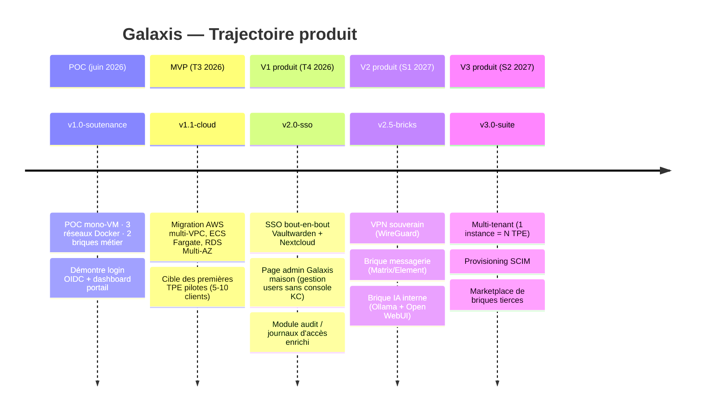

# 09 — Roadmap

> **Audience** : sponsor, investisseur, future équipe · **Source slides** : 16, 17, 18

---

## Vision à 18 mois

---

## Jalons détaillés

### 🎯 Jalon 1 — v1.0-soutenance (26 juin 2026) — **FAIT**

Cf. ce dépôt. Objectif : démontrer la faisabilité, valider la DA, livrer 3 docs et la présentation.

### 🎯 Jalon 2 — v1.1-cloud (T3 2026)

| Tâche | Effort | Critique ? |
|---|:---:|:---:|
| Compte AWS + organisation + landing zone | 5 j | ✅ |
| Terraform IaC (3 VPC, RDS, ElastiCache, ECS cluster, ALB, ACM, WAF) | 15 j | ✅ |
| Migration images vers ECR | 3 j | ✅ |
| CI/CD GitHub Actions (lint+test+build+deploy) | 5 j | ✅ |
| Migration data : exports POC → imports RDS | 3 j | ✅ |
| Monitoring CloudWatch + alarmes SNS | 5 j | recommandé |
| Test de charge léger (k6 ou Locust) | 3 j | recommandé |
| Premier client pilote (TPE volontaire) | 10 j | ✅ |
| Rétrofit documentation cible AWS | 3 j | ✅ |
| **Total** | **~52 j-h** | |

### 🎯 Jalon 3 — v2.0-sso (T4 2026)

| Tâche | Effort |
|---|:---:|
| Fédération OIDC Nextcloud (`user_oidc` app + config Keycloak client) | 8 j |
| Fédération OIDC Vaultwarden (workaround : SSO via Bitwarden hosted via reverse trust) | 12 j |
| Page admin Galaxis maison (CRUD users via API Keycloak, UI React) | 15 j |
| Module audit enrichi (rétention 90j, recherche, alertes seuils) | 8 j |
| Tests E2E Playwright bout-en-bout | 7 j |
| Documentation utilisateur enrichie | 5 j |
| **Total** | **~55 j-h** |

### 🎯 Jalon 4 — v2.5-bricks (S1 2027)

| Tâche | Effort |
|---|:---:|
| Brique VPN WireGuard (`wg-easy` ou `firezone`) + intégration claims | 15 j |
| Brique messagerie Matrix (Synapse + Element) | 20 j |
| Brique IA interne (Open WebUI + Ollama, GPU optionnel) | 12 j |
| API d'extension (bus d'événements pub/sub pour les briques) | 15 j |
| **Total** | **~62 j-h** |

### 🎯 Jalon 5 — v3.0-suite (S2 2027)

| Tâche | Effort |
|---|:---:|
| Multi-tenant (1 realm = 1 TPE, isolation logique) | 25 j |
| Provisioning SCIM (sync depuis annuaire RH) | 12 j |
| Marketplace de briques tierces (manifest + signing) | 30 j |
| Plan commercial managed services (offres Starter/Pro/Sovereign) | 20 j |
| **Total** | **~87 j-h** |

---

## Indicateurs de succès par jalon

| Jalon | Indicateurs |
|---|---|
| v1.0 | POC démontrable ; 0 secret commité ; couverture tests ≥ 60% |
| v1.1 | 1 client pilote en prod AWS ; uptime ≥ 99,5% / 30j ; latence p95 < 200 ms |
| v2.0 | SSO bout-en-bout marchant ; page admin utilisable par Marc sans assistance |
| v2.5 | 3 briques additionnelles live ; SDK d'extension documenté |
| v3.0 | 10+ TPE clients ; CA mensuel récurrent ≥ 5 000 € ; NPS > 30 |

---

## Hypothèses post-MVP à valider en client pilote

| Hypothèse | Méthode de validation |
|---|---|
| Marc accepte d'héberger lui-même (vs SaaS) | interviews 5 clients pilotes |
| Le prix Starter (~50 €/mois) couvre les coûts d'infra + support | suivi P&L par client sur 3 mois |
| L'onboarding admin < 1 h | observation + chrono sur 5 onboardings |
| L'offboarding 1 clic est utilisé en réel | logs d'audit sur 3 mois |
| Marc parle de Galaxis spontanément à un pair | demande qualitative + signature de partenariats de coopératives TPE |

---

## Risques produit longue durée

| Risque | Mitigation |
|---|---|
| Keycloak abandonné par Red Hat | Fork communautaire actif (Keycloak Quarkus depuis 2022) — backup possible |
| Vaultwarden process trop léger pour des org > 100 users | Migration cible vers Bitwarden Server officiel (compatible) |
| Législation européenne change radicalement | Veille DORA/NIS2 mensuelle, ajustement produit |
| Concurrent SaaS US adopte la même promesse souveraineté | Différenciation par open source + audit transparent |

---

## Hypothèse de financement

| Étape | Source | Volume |
|---|---|---|
| v1.0 → v1.1 | Auto-financement AstroTechs | 15 000 € |
| v2.0 → v2.5 | Premiers clients pilotes + subvention French Tech | 50 000 € |
| v3.0 | Bourse Bpifrance / love money | 150 000 € |

Pas de levée VC visée — l'objectif est un produit **rentable rapidement** sur un segment niche, pas une licorne à coûts élevés.

---

## Vision long terme

> *Devenir, à 5 ans, **la solution par défaut** d'orchestration souveraine d'écosystème open source pour les **TPE/PE francophones** de 1 à 50 personnes. Une marque que Marc cite naturellement à ses pairs dirigeants : « Tu sais, Galaxis. »*

---

## Conclusion

Le POC valide la faisabilité. Le MVP validera le marché. Le V1 produit créera la rentabilité. Le V3 créera l'effet de plateforme.

Le **plus dur**, ce n'est pas le code — c'est de **rester focus** : ne pas céder à la tentation d'ajouter chaque brique cool, ni de viser tout le monde. Marc et sa TPE, c'est la boussole. Tout le reste découle.

---

## Liens internes

- Difficultés POC : [08-difficultes-apprentissages.md](./08-difficultes-apprentissages.md)
- Architecture cible : [../technique/02-architecture-cible.md](../technique/02-architecture-cible.md)
- Proposition de valeur : [04-proposition-valeur.md](./04-proposition-valeur.md)
