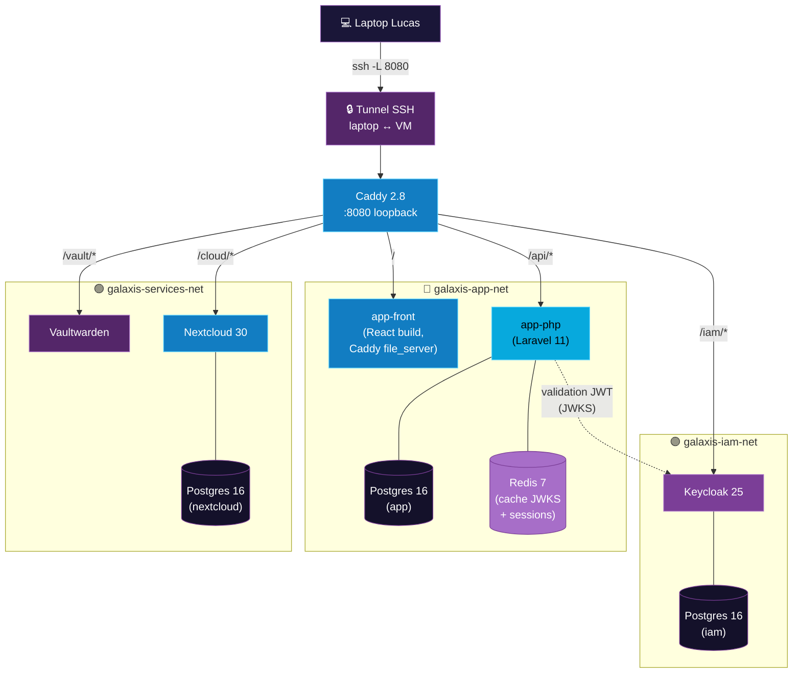
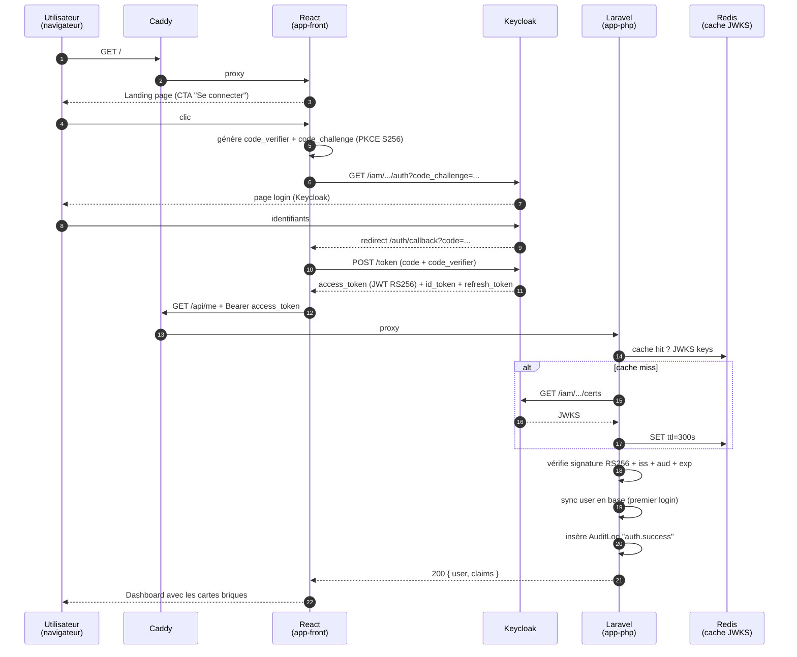

# 01 — Architecture du POC

> **Audience** : devops, admin sys, architectes · **Source slides** : 08, 10, 13, A02

---

## Résumé en une phrase

Le POC Galaxis est un déploiement **mono-VM Debian** orchestré par **Docker Compose**, comportant **11 conteneurs** répartis sur **3 réseaux Docker isolés**, accessibles via un **reverse proxy Caddy unique sur `127.0.0.1:8080`**.

---

## Vue d'ensemble

---

## Inventaire des 11 conteneurs

| # | Conteneur | Image | Rôle | Réseau(x) |
|---|---|---|---|---|
| 1 | `galaxis-proxy` | `caddy:2.8-alpine` | Reverse proxy unique, routage par chemin | `iam-net`, `app-net`, `services-net` |
| 2 | `galaxis-keycloak` | `quay.io/keycloak/keycloak:25.0` | IAM, émission de JWT, JWKS | `iam-net` |
| 3 | `galaxis-iam-db` | `postgres:16-alpine` | Persistance Keycloak | `iam-net` |
| 4 | `galaxis-app-front` | image multistage Vite + Caddy | Build React 18 servi statique | `app-net` |
| 5 | `galaxis-app-php` | image custom php8.3 + nginx | API Laravel 11 (`/api/*`) | `app-net`, `iam-net` |
| 6 | `galaxis-app-db` | `postgres:16-alpine` | Persistance Laravel (users, audit_logs) | `app-net` |
| 7 | `galaxis-app-redis` | `redis:7-alpine` | Cache JWKS + sessions + cache Laravel | `app-net` |
| 8 | `galaxis-vaultwarden` | `vaultwarden/server:1.32.4` | Coffre-fort de mots de passe | `services-net` |
| 9 | `galaxis-nextcloud` | `nextcloud:30-apache` | Drive collaboratif | `services-net` |
| 10 | `galaxis-nextcloud-db` | `postgres:16-alpine` | Persistance Nextcloud | `services-net` |
| 11 | *(volumes Docker nommés)* | n/a | iam-db-data, app-db-data, app-redis-data, vaultwarden-data, nextcloud-data, nextcloud-db-data | — |

> Le décompte « 11 conteneurs » de la slide 15 inclut le proxy et tous les Postgres, en ignorant les volumes. Le décompte exact des **services** dans `docker-compose.yml` est de **10 services applicatifs** + le proxy.

---

## Choix d'architecture clés

### Pourquoi un reverse proxy unique sur 127.0.0.1:8080 ?

- **Contrainte démo** : Lucas doit pouvoir présenter depuis un laptop via un **simple tunnel SSH**, sans certificat à importer ni modification de `/etc/hosts`.
- **Solution** : Caddy écoute uniquement sur `127.0.0.1:8080` (loopback). Le trafic laptop → VM est chiffré par SSH lui-même. Pas de TLS supplémentaire à orchestrer.
- **Routage par chemin** : `/`, `/api`, `/iam`, `/vault`, `/cloud` → une seule URL à mémoriser.

> 💡 La slide 11 (archi cible AWS) montre que la prod utilise un ALB + ACM + Let's Encrypt. Ce n'est **pas une régression** du POC, c'est une simplification documentée pour la démo locale.

### Pourquoi 3 réseaux Docker isolés ?

L'idée vient des slides 08 et 10 : isoler les briques pour limiter la surface d'attaque latérale (un Vaultwarden compromis ne doit pas pouvoir scanner Keycloak directement).

| Réseau | Membres | Raison |
|---|---|---|
| `galaxis-iam-net` | Keycloak + sa DB | Aucune brique métier ne dialogue directement avec la DB Keycloak |
| `galaxis-app-net` | Laravel + sa DB + Redis + React | L'app a sa propre DB métier, son cache, et sert le front |
| `galaxis-services-net` | Vaultwarden + Nextcloud + sa DB | Briques utilisateurs, indépendantes côté réseau |

Les **deux ponts** sont volontaires :
- `app-php` est sur `app-net` **et** `iam-net` → il doit pouvoir appeler `http://keycloak:8080/iam/.../certs` pour récupérer les JWKS
- `proxy` est sur les **3 réseaux** → c'est son rôle, on lui fait confiance

### Pourquoi Laravel + React et pas un framework full-stack ?

- **Laravel 11** : mature pour l'API REST, son écosystème (Eloquent, queues, scheduler) servira pour la v2 (cache, monitoring, notifications).
- **React + Vite** : type-safe avec TypeScript, écosystème OIDC mature (`oidc-client-ts`), build léger servi statique par Caddy (pas de SSR — inutile pour un portail interne).
- Séparer front/back force des **contrats API explicites** dès le POC, ce qui facilite la migration vers AWS.

---

## Flux principal (login + dashboard)

---

## Empreinte ressources estimée (VM 2 vCPU / 4 GB RAM)

| Service | RAM en idle | RAM sous charge | CPU |
|---|---|---|---|
| Keycloak (JVM) | ~400 MB | ~700 MB | bursty au démarrage |
| Laravel (php-fpm 8 workers) | ~150 MB | ~400 MB | léger |
| React (Caddy file_server) | ~10 MB | ~15 MB | négligeable |
| Postgres ×3 | ~50 MB chacune | ~100 MB sous charge | léger |
| Redis | ~10 MB | ~30 MB | négligeable |
| Vaultwarden (Rust) | ~25 MB | ~60 MB | léger |
| Nextcloud (Apache + PHP) | ~150 MB | ~350 MB | moyen |
| **Total POC démo** | **~900 MB** | **~1.8 GB** | **< 1 vCPU steady** |

Recommandation VM : **2 vCPU, 4 GB RAM, 30 GB disque SSD**. Au-delà = confort.

---

## ⚠️ Différences entre `docker-compose.yml` racine et `deployments/*/docker-compose.yml`

- Le **`docker-compose.yml` racine** orchestre TOUS les services en une commande (`make demo`). C'est le chemin par défaut pour la démo locale.
- Les **compose files dans `deployments/`** sont des découpages tier-par-tier utilisés par les playbooks Ansible (un playbook par tier). Ils référencent les mêmes images et variables.

Ne pas mélanger les deux : si vous lancez `make demo`, tout part du fichier racine. Si vous déployez via Ansible sur une VM, ce sont les fichiers de `deployments/` qui tournent.

---

## Liens internes
- Détails réseaux : [08-reseaux-docker.md](./08-reseaux-docker.md)
- Stack précise : [03-stack-technique.md](./03-stack-technique.md)
- Flow OIDC : [07-flow-oidc-jwt.md](./07-flow-oidc-jwt.md)
- Cible AWS : [02-architecture-cible.md](./02-architecture-cible.md)
