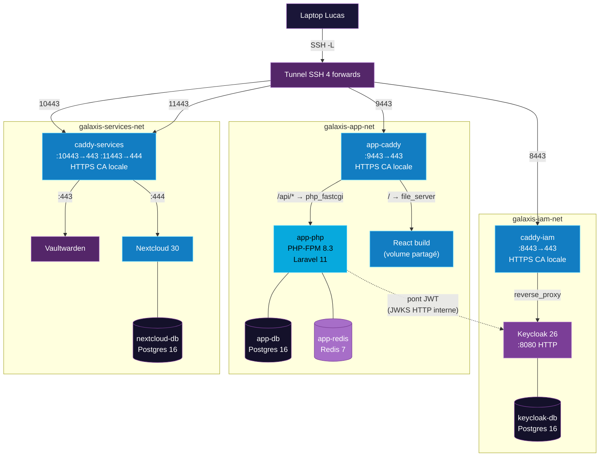

# 01 — Architecture du POC

> **Audience** : devops, admin sys, architectes · **Version** : v1.1-conteneurise · **Source slides** : 08, 10, 12, 13, 15, A01

---

## Résumé

Le POC Galaxis est un déploiement **mono-VM Debian** orchestré par un **docker-compose.yml** unique, comportant **11 conteneurs running** répartis sur **3 réseaux Docker isolés**, chacun fronté par son propre **Caddy HTTPS** avec CA locale. Accès via **tunnel SSH** depuis le laptop du présentateur.

---

## Vue d'ensemble (11 conteneurs · 3 Caddy · 3 réseaux)

---

## Inventaire des 11 conteneurs running

| # | Conteneur | Image | Port interne | Réseau(x) | Rôle |
|---|---|---|---|---|---|
| 1 | `caddy-iam` | `caddy:2-alpine` | 443 (HTTPS) | `iam-net` | Frontal HTTPS du tier IAM |
| 2 | `keycloak` | `quay.io/keycloak/keycloak:26.0` | 8080 (HTTP) | `iam-net` | IAM, émission JWT RS256, JWKS |
| 3 | `keycloak-db` | `postgres:16-alpine` | 5432 | `iam-net` | Persistance Keycloak |
| 4 | `app-caddy` | `caddy:2-alpine` | 443 (HTTPS) | `app-net` | Frontal HTTPS, sert React + proxy API |
| 5 | `app-php` | custom php:8.3-fpm | 9000 (FPM) | **`app-net` + `iam-net`** | API Laravel, **pont JWT** |
| 6 | `app-db` | `postgres:16-alpine` | 5432 | `app-net` | Persistance Laravel |
| 7 | `app-redis` | `redis:7-alpine` | 6379 | `app-net` | Cache JWKS + sessions |
| 8 | `caddy-services` | `caddy:2-alpine` | 443, 444 (HTTPS) | `services-net` | Frontal HTTPS Vault + Cloud |
| 9 | `vaultwarden` | `vaultwarden/server:latest` | 80, 3012 (WS) | `services-net` | Coffre-fort mots de passe |
| 10 | `nextcloud` | `nextcloud:apache` | 80 | `services-net` | Drive collaboratif |
| 11 | `nextcloud-db` | `postgres:16-alpine` | 5432 | `services-net` | Persistance Nextcloud |

(+ 1 conteneur **one-shot** `frontend-builder` qui exit après build → non running)

---

## Mapping des ports loopback VM

Tous les ports sont bindés sur `127.0.0.1` uniquement (jamais `0.0.0.0`).

| Port VM | Caddy cible | Brique | URL navigateur laptop |
|---|---|---|---|
| `127.0.0.1:8443` | caddy-iam:443 | Keycloak | `https://localhost:8443` |
| `127.0.0.1:9443` | app-caddy:443 | Portail Galaxis | `https://localhost:9443` |
| `127.0.0.1:10443` | caddy-services:443 | Vaultwarden | `https://localhost:10443` |
| `127.0.0.1:11443` | caddy-services:444 | Nextcloud | `https://localhost:11443` |

---

## Le pont JWT — app-php multi-réseau (slide 12)

`app-php` est le **seul conteneur attaché à deux réseaux** :
- `galaxis-app-net` : accès à app-db, app-redis, app-caddy
- `galaxis-iam-net` : accès à keycloak (pour récupérer les JWKS HTTP en interne)

Ce pont est documenté dans la slide 12 (flow JWT). Le middleware Laravel `ValidateJwt` appelle `http://keycloak:8080/realms/galaxis/protocol/openid-connect/certs` pour récupérer les clés publiques, les cache dans Redis (TTL 5 min), et vérifie chaque access_token reçu.

---

## HTTPS via CA Caddy locale

Chaque Caddy frontal utilise `tls internal` : Caddy génère un certificat auto-signé depuis sa propre CA interne. Le navigateur affiche un **warning "certificat non reconnu"** au premier accès — c'est attendu et documenté dans le guide démo.

Option pré-démo pour zéro warning : récupérer les CA via `make ca` et les importer dans le navigateur (cf. Makefile target `ca-iam` / `ca-app` / `ca-services`).

---

## React = build statique (pas un conteneur running)

Le frontend React n'a **pas** de conteneur dédié running. Un conteneur one-shot `frontend-builder` (node:20-alpine) fait `npm run build` et copie le résultat dans un **volume nommé** `galaxis-frontend-build`. Ce volume est monté en lecture seule par `app-caddy` sur `/srv/frontend`, qui sert les fichiers statiques avec fallback SPA.

---

## Liens internes
- Réseaux isolés et matrice de communication : [08-reseaux-docker.md](./08-reseaux-docker.md)
- Installation pas-à-pas : [04-installation.md](./04-installation.md)
- Flow OIDC + validation JWT : [07-flow-oidc-jwt.md](./07-flow-oidc-jwt.md)
- Architecture cible AWS : [02-architecture-cible.md](./02-architecture-cible.md)
