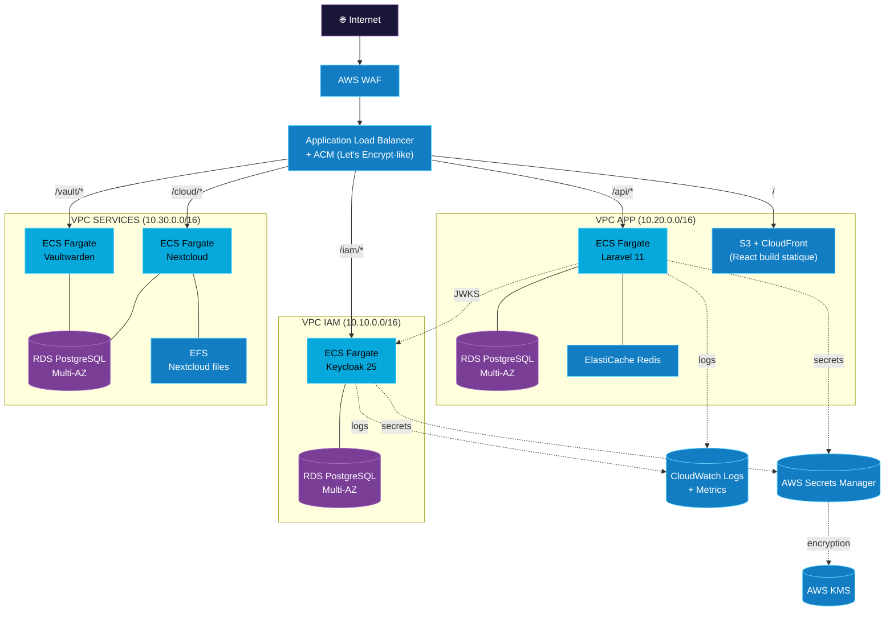

# 02 — Architecture cible AWS

> **Audience** : architectes, devops, équipe migration · **Source slides** : 09, 11, 16, 17

---

## Pourquoi ce chapitre existe ?

Le POC tourne sur **une seule VM Debian**. C'est volontairement le plus simple possible. Mais la décision a été prise dès le cadrage de **dessiner la cible production AWS en parallèle**, pour :

1. **Faciliter la migration** : pas de surprise quand on basculera (rien d'incompatible n'a été choisi)
2. **Rassurer le jury** : on sait où on va, et on a une trajectoire crédible
3. **Forcer la rigueur dans le POC** : si on doit migrer, il faut des contrats nets (API, JWT, headers, secrets)

---

## Vue d'ensemble cible

---

## Mapping POC → cible

| Sujet | POC (mono-VM) | Cible (AWS) |
|---|---|---|
| **Compute** | Docker Compose | ECS Fargate (tâches conteneurisées sans EC2 à gérer) |
| **Frontend** | Caddy file_server | S3 + CloudFront |
| **Reverse proxy / TLS** | Caddy HTTP loopback + tunnel SSH | ALB + ACM (cert Let's Encrypt-like managé) |
| **DB** | 3 Postgres en conteneur | RDS Multi-AZ (× 3 instances) |
| **Cache** | Redis conteneur | ElastiCache Redis (cluster) |
| **Stockage fichiers** | Volume Docker `nextcloud-data` | EFS (NFS managé) |
| **Secrets** | `.env` chiffré par Ansible Vault | AWS Secrets Manager + KMS |
| **Isolation réseau** | 3 networks Docker | 3 VPC isolés + Security Groups |
| **Logs** | stdout → docker logs | CloudWatch Logs |
| **Monitoring** | (OUT scope POC) | CloudWatch + métriques ECS + alarmes SNS |
| **Backup DB** | (manuel, `pg_dump` ad hoc) | RDS automated snapshots + PITR |
| **WAF** | (OUT scope POC) | AWS WAF en amont de l'ALB |
| **CI/CD** | (OUT scope POC) | GitHub Actions → ECR → ECS rolling update |
| **DNS** | (sans objet — tunnel SSH) | Route 53 (`portal.galaxis.fr`) |
| **HTTPS** | Chiffrement SSH (uniquement laptop↔VM) | TLS end-to-end (cert ACM auto-renouvelé) |

---

## Région et availability zones

- **Région** : `eu-west-3` (Paris) — souveraineté de la donnée (cf. slide 11)
- **AZ** : multi-AZ par défaut sur RDS et ECS (le POC est *single-instance*, la prod est *multi-instance*)

---

## Politique réseau cible

- **3 VPC isolés** (`/16` chacun, ranges privés non chevauchants)
- Pas de VPC peering : les briques communiquent **via l'ALB** (donc en passant par les règles WAF et la sécurité applicative)
- **NAT Gateway** dans chaque VPC pour les besoins sortants (Composer, image pulls)
- **Security Groups** : règles minimales (ex : SG du backend Laravel autorise sortant 443 vers SG Keycloak uniquement)

---

## Ce qui reste OUT scope même en cible

- **SSO bout-en-bout vers Vaultwarden et Nextcloud** : c'est un développement spécifique (writing OIDC providers pour chaque brique). Prévu pour v2.0 (cf. roadmap).
- **MFA** : feature Keycloak à activer dans la config realm, mais hors POC.
- **Multi-tenancy** : un realm = un tenant. La cible v1 reste single-tenant.

---

## Ordre de migration suggéré (3 sprints)

| Sprint | Tâches | Risque |
|---|---|---|
| **S1** | VPC + ECS cluster + ECR + RDS IAM + Keycloak Fargate task | Faible |
| **S2** | RDS APP + ElastiCache + ECS task Laravel + S3/CloudFront front | Moyen (validation flow OIDC bout-en-bout) |
| **S3** | RDS SERVICES + Vaultwarden + Nextcloud + EFS + WAF + alarmes | Faible |

À chaque sprint, **on rejoue le même `make test`** sur l'environnement, et la même checklist de smoke test : login OIDC, dashboard, claims affichés, ouverture Vaultwarden, ouverture Nextcloud.

---

## Estimation budget AWS (eu-west-3, ordre de grandeur)

| Poste | Tarif estimé / mois |
|---|---|
| 3× ECS Fargate (1 vCPU / 2 GB, 24/7) | ~80 € |
| 3× RDS db.t4g.micro Multi-AZ | ~120 € |
| ElastiCache cache.t4g.micro | ~20 € |
| ALB + 1 TB transfert | ~30 € |
| S3 + CloudFront (assets + 100 GB transfert) | ~10 € |
| EFS (~50 GB Nextcloud) | ~15 € |
| CloudWatch (logs + alarmes) | ~15 € |
| Secrets Manager + KMS | ~10 € |
| **Total approximatif** | **~300 €/mois** |

> Pour une TPE de 10 personnes, à comparer aux 850 €/mois de SaaS cumulés cités par Marc (slide 5).

---

## Liens internes
- POC actuel : [01-architecture-poc.md](./01-architecture-poc.md)
- Sécurité : [09-securite.md](./09-securite.md)
- Roadmap migration : [../projet/09-roadmap.md](../projet/09-roadmap.md)
