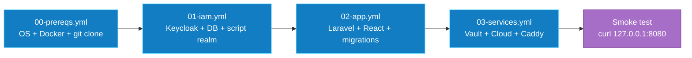

# 05 — Déploiement Ansible

> **Audience** : devops, sre · **Source** : `infrastructure/ansible/playbooks/*.yml`

Ce chapitre décrit le déploiement automatique du POC via les **4 playbooks Ansible** (validés idempotents — relançables sans casser).

---

## Pré-requis poste opérateur

- Ansible **core 2.16+** (`pip install ansible-core`)
- Collections : `community.general`, `ansible.posix`
- Clé SSH déjà déployée sur la VM, sudoer sans mot de passe

```bash
cd /home/user/Galaxis-POC/infrastructure/ansible
ansible-galaxy collection install -r requirements.yml
```

---

## Pré-requis VM

- Debian 12 ou 13, vierge
- Utilisateur sudoer accessible en SSH par clé
- Outbound HTTP/HTTPS ouvert (pour pull les images Docker)

---

## Préparer l'inventory

```bash
cd infrastructure/ansible
cp inventory.example inventory
$EDITOR inventory
```

Remplir au moins :
- `ansible_host` (IP ou FQDN VM)
- `ansible_user` (sudoer, ex: `deploy`)
- `ansible_ssh_private_key_file` (chemin local de la clé)
- `galaxis_app_dir` (par défaut `/opt/galaxis`)
- `galaxis_git_repo` (URL du dépôt git)

---

## Les 4 playbooks



### Ordre obligatoire

L'ordre **00 → 01 → 02 → 03** est non négociable :
- `00` pose Docker, le code, le firewall
- `01` doit être healthy **avant** que `02` démarre (Laravel valide les JWT contre Keycloak au boot)
- `03` arrive en dernier (les briques services sont indépendantes mais le proxy a besoin que tout soit up)

---

## Lancer

```bash
# Tout d'un coup (le plus courant) :
make ansible-all

# Ou étape par étape :
make ansible-prereqs
make ansible-iam
make ansible-app
make ansible-services
```

---

## Détail des playbooks

### `00-prereqs.yml`

Idempotent. Couvre :
- `apt update` + paquets de base (git, curl, jq, ufw, fail2ban, unattended-upgrades)
- Swap 2 GB (créé si absent, sinon skip)
- UFW : default deny incoming, allow outgoing, allow 22/tcp
- fail2ban activé
- Docker CE + Compose plugin depuis le repo officiel Docker
- Ajout utilisateur au groupe `docker`
- Clone du repo Galaxis dans `{{ galaxis_app_dir }}`

**Idempotence garantie par** : `apt` (state=present), `git` (update=true sur même version), `ufw` (rules de présence).

### `01-iam.yml`

Idempotent. Couvre :
- Vérifie/copie `.env.example` → `.env` (mode 0600, owner deploy)
- `docker compose up -d` sur `deployments/iam/`
- Attend `curl /iam/health/ready` jusqu'à 60×3s = 3 min
- Lance `configure-keycloak.sh` (le script est lui-même idempotent : check d'existence avant create pour le realm, le client et chaque user)

⚠️ **Si vous changez le mot de passe admin Keycloak après le premier déploiement**, le script échouera car il s'authentifie avec l'ancien. Procédure : ouvrir la console Keycloak en navigateur (par tunnel SSH), changer le password, puis adapter le `.env`.

### `02-app.yml`

Idempotent. Couvre :
- `docker compose build` (frontend Vite + backend PHP)
- `docker compose up -d` sur `deployments/app/`
- Attend que `app-php` réponde
- `php artisan migrate --force` (Laravel migrations sont elles-mêmes idempotentes via la table `migrations`)
- `config:cache` + `route:cache` pour les perfs prod

### `03-services.yml`

Idempotent. Couvre :
- `docker compose up -d` sur `deployments/services/` (Vaultwarden + Nextcloud + DB)
- `docker compose up -d` sur `deployments/proxy/` (Caddy)
- Smoke test : `curl http://127.0.0.1:8080/` doit renvoyer 200 (ou 302)

---

## Idempotence — vérifier

Relancer un playbook ne doit changer aucun état. Pour vérifier :

```bash
ansible-playbook -i inventory playbooks/00-prereqs.yml
# Premier run : beaucoup de "changed"
ansible-playbook -i inventory playbooks/00-prereqs.yml
# Deuxième run consécutif : 0 changed attendu
```

Si vous voyez du `changed: …` au deuxième run, c'est un bug d'idempotence : signalez-le.

---

## Rollback

Le POC n'a pas (encore) de stratégie blue/green. Pour rollback :

```bash
# Sur la VM :
cd /opt/galaxis
git fetch --tags
git checkout <tag-précédent>
make restart
docker exec galaxis-app-php php artisan migrate --force
```

Si vous avez fait une migration destructive, restaurez d'abord la DB depuis un dump :

```bash
docker exec -i galaxis-app-db pg_restore -U galaxis -d galaxis < backup.dump
```

(Cf. chapitre [10-exploitation](./10-exploitation.md) pour la stratégie backup.)

---

## ⚠️ Sécurité Ansible Vault

Pour les déploiements en équipe, ne **JAMAIS commiter le `.env`**. Utilisez :

```bash
# Côté opérateur, créer un fichier chiffré :
ansible-vault encrypt_string 'super-secret-password' --name 'KC_DB_PASSWORD'

# Ce qui donne un YAML chiffré à placer dans group_vars/galaxis_vm/vault.yml :
KC_DB_PASSWORD: !vault |
  $ANSIBLE_VAULT;1.1;AES256
  6432386666...

# Déployer en fournissant le mot de passe vault :
ansible-playbook --ask-vault-pass -i inventory playbooks/01-iam.yml
```

Le mot de passe vault est partagé via canal sécurisé (pas le repo).

---

## Liens internes
- Architecture POC : [01-architecture-poc.md](./01-architecture-poc.md)
- Configuration Keycloak : [06-iam-keycloak.md](./06-iam-keycloak.md)
- Exploitation : [10-exploitation.md](./10-exploitation.md)
