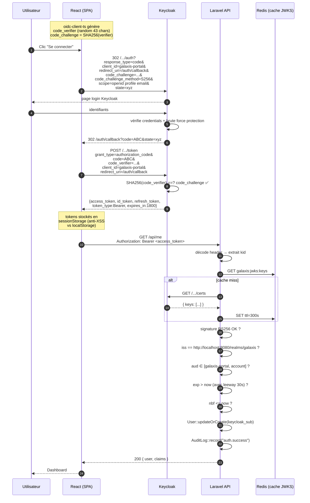

# 07 — Flow OIDC + validation JWT

> **Audience** : développeurs, sécurité · **Source** : `backend/app/Http/Middleware/ValidateJwt.php`, `backend/app/Services/JwtValidator.php`, `frontend/src/lib/oidc.ts`

---

## Vue d'ensemble

Galaxis utilise le **flow OAuth 2.0 Authorization Code + PKCE S256** (le seul recommandé pour SPA en 2026), suivi d'une **validation serveur** des JWT par signature RS256 contre les JWKS de Keycloak.

---

## Diagramme de séquence complet



---

## Pourquoi PKCE est obligatoire pour un SPA

Un SPA tourne dans le navigateur — **impossible** de stocker un client_secret en sécurité (il serait dans le code JS, donc public). On utilise donc un **client public**.

Sans PKCE, un attaquant qui intercepte le `code` (via une extension malveillante, une attaque MITM sur le réseau public, etc.) pourrait l'échanger contre un token. Avec PKCE :

1. Le client génère un `code_verifier` aléatoire (64 chars), le garde en mémoire
2. Il envoie `code_challenge = SHA256(code_verifier)` à Keycloak
3. Keycloak retient le `code_challenge` lié au `code` qu'il émet
4. Au retour, le client doit fournir `code_verifier` ; Keycloak vérifie que `SHA256(code_verifier) == code_challenge`

Conclusion : **même si le `code` fuit**, l'attaquant ne peut pas l'échanger (il n'a pas le `code_verifier`).

---

## Structure d'un access_token Keycloak

Exemple décodé (claims importants) :

```json
{
  "exp": 1716580800,
  "iat": 1716579000,
  "auth_time": 1716579000,
  "jti": "abc-uuid",
  "iss": "http://localhost:8080/realms/galaxis",
  "aud": "account",
  "sub": "f0e1d2c3-...",
  "typ": "Bearer",
  "azp": "galaxis-portal",
  "session_state": "...",
  "acr": "1",
  "realm_access": { "roles": ["default-roles-galaxis", "offline_access", "uma_authorization"] },
  "resource_access": { "account": { "roles": ["manage-account", "view-profile"] } },
  "scope": "openid profile email",
  "email_verified": true,
  "name": "Lucas Test",
  "preferred_username": "lucas-test",
  "given_name": "Lucas",
  "family_name": "Test",
  "email": "lucas-test@galaxis.local"
}
```

Header :
```json
{ "alg": "RS256", "typ": "JWT", "kid": "abc123-key-id" }
```

---

## Validation côté Laravel — détails

### Étape 1 — extraction du token

Middleware [`ValidateJwt`](../../../backend/app/Http/Middleware/ValidateJwt.php) :

```php
$auth = (string) $request->header('Authorization', '');
if (! str_starts_with($auth, 'Bearer ')) { return 401; }
$token = substr($auth, 7);
```

### Étape 2 — lecture du `kid` (sans validation)

Le `kid` est dans le header JWT (en base64 url). On le décode pour savoir **quelle clé publique chercher**.

```php
$header = json_decode(base64_decode($parts[0]), true);
$kid = $header['kid'] ?? null;
```

### Étape 3 — récupération de la clé via JWKS (cache Redis)

[`JwksService`](../../../backend/app/Services/JwksService.php) :

```php
public function getKeyForKid(string $kid): ?Key
{
    $keys = $this->getKeys(false);          // cache hit
    if (isset($keys[$kid])) return $keys[$kid];
    $keys = $this->getKeys(true);           // forcer refresh (rotation)
    return $keys[$kid] ?? null;
}
```

- **Cache hit** (cas nominal) : pas d'appel HTTP, lecture Redis
- **Cache miss / `kid` inconnu** : on fetch `/.../certs` et on remplit le cache

### Étape 4 — validation cryptographique + claims

[`JwtValidator`](../../../backend/app/Services/JwtValidator.php) :

```php
JWT::$leeway = config('oidc.leeway', 30);                  // 30s tolérance horloge
$payload = (array) JWT::decode($jwt, $key);                // signature + exp + nbf

// iss
if ($payload['iss'] !== "http://localhost:8080/realms/galaxis") {
    throw new UnexpectedValueException('iss mismatch');
}
// aud (peut être string OU array)
$accepted = ['galaxis-portal', 'account'];
if (empty(array_intersect((array) $payload['aud'], $accepted))) {
    throw new UnexpectedValueException('aud not accepted');
}
```

### Étape 5 — sync utilisateur + audit log

Une fois validé :

```php
$user = User::updateOrCreate(
    ['keycloak_sub' => $claims['sub']],
    ['username' => ..., 'email' => ..., 'last_login_at' => now()],
);
AuditLog::record($user->id, 'auth.success', [...], $request);
```

---

## Politique de cache JWKS

| Paramètre | Valeur | Justification |
|---|---|---|
| Store | Redis (DB 1) | partagé entre tous les workers php-fpm |
| TTL | 300s (5 min) | Keycloak fait du key rotation peu fréquente |
| Clé | `galaxis:jwks:keys` | namespace clair |
| Refresh on miss | OUI | si kid inconnu (rotation) → re-fetch immédiat |

> Si Keycloak est en train de rotater ses clés, on a au pire 5 minutes de retard. Le mécanisme de "refresh on kid miss" évite tout downtime utilisateur.

---

## Refresh token

`oidc-client-ts` est configuré avec `automaticSilentRenew: true`. Quand `expires_at` approche, il appelle silencieusement Keycloak avec le `refresh_token` pour obtenir un nouvel `access_token`, sans interaction utilisateur.

Si le refresh échoue (token révoqué, session max atteinte), l'event `SilentRenewError` est émis ; le hook `useAuth` bascule en `anonymous` et la page se reprotège (Navigate to `/`).

---

## Vérifier manuellement la validation

```bash
# Token bidon → 401 immediate (signature invalide)
curl -i http://localhost:9080/api/me -H "Authorization: Bearer this.is.not.a.jwt"

# Token expiré → 401 (exp dépassé)
# Token volé pour un autre realm → 401 (iss mismatch)
# Token valide → 200 avec claims
```

---

## Tests automatisés

Fichier : `backend/tests/Feature/JwtMiddlewareTest.php`

Couvre 8 cas :
1. token absent → 401 `missing_bearer`
2. token malformé → 401 `invalid_token`
3. signature invalide → 401
4. issuer invalide → 401
5. audience invalide → 401
6. token expiré → 401
7. kid inconnu → 401
8. token valide → 200 + user créé + audit log

Plus 2 tests unitaires `JwksServiceCacheTest` pour le cache hit.

---

## Erreurs courantes

| Symptôme | Cause probable | Fix |
|---|---|---|
| 401 `iss mismatch` | `KC_BASE_PUBLIC` mal configuré dans `.env` | Vérifier que la valeur est exactement l'URL exposée par Keycloak |
| 401 alors que token "fraichement obtenu" | Décalage d'horloge VM/dev | Augmenter `JWT_LEEWAY` à 60s temporairement, fixer NTP |
| Tous les calls 401 après rotation Keycloak | Cache JWKS vieux mais kid inchangé | Manuel : `docker exec app-redis redis-cli -a $REDIS_PASSWORD DEL galaxis:jwks:keys` |
| `aud not accepted` | Le client envoie `aud=account` (par défaut) | Vérifier que `'account'` est dans `accepted_audiences` (déjà le cas) |

---

## Liens internes
- IAM Keycloak : [06-iam-keycloak.md](./06-iam-keycloak.md)
- Sécurité : [09-securite.md](./09-securite.md)
- Architecture POC : [01-architecture-poc.md](./01-architecture-poc.md)
