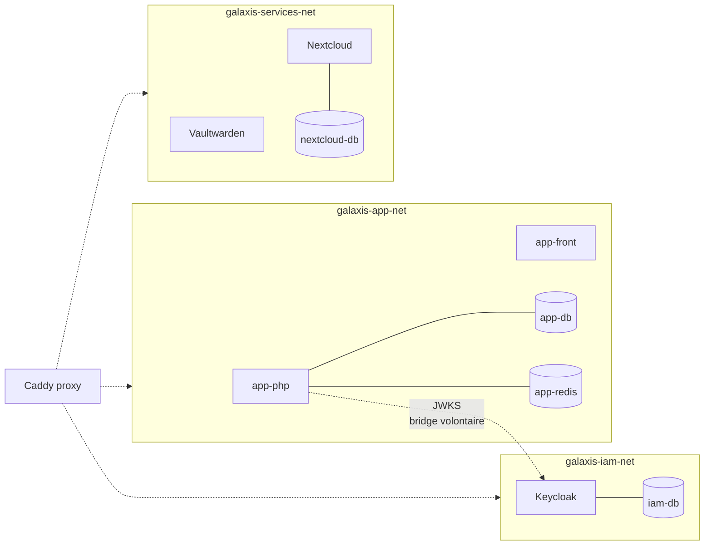

# 08 — Réseaux Docker isolés

> **Audience** : devops, sécurité réseau · **Source** : `docker-compose.yml`, slide 10

---

## Pourquoi 3 réseaux et pas 1

Par défaut, Docker met tous les services d'un compose dans un seul bridge réseau. Tout le monde peut parler à tout le monde.

**Pour Galaxis, on veut limiter le blast radius** : si un service est compromis (ex : un bug dans Nextcloud), il ne doit **pas** pouvoir scanner Keycloak ou la base Laravel.

D'où 3 networks, **un par tier fonctionnel** :



---

## Tableau d'attachement des conteneurs

| Conteneur | iam-net | app-net | services-net |
|---|:---:|:---:|:---:|
| `galaxis-keycloak` | ✅ | ❌ | ❌ |
| `galaxis-iam-db` | ✅ | ❌ | ❌ |
| `galaxis-app-php` | ✅ | ✅ | ❌ |
| `galaxis-app-front` | ❌ | ✅ | ❌ |
| `galaxis-app-db` | ❌ | ✅ | ❌ |
| `galaxis-app-redis` | ❌ | ✅ | ❌ |
| `galaxis-vaultwarden` | ❌ | ❌ | ✅ |
| `galaxis-nextcloud` | ❌ | ❌ | ✅ |
| `galaxis-nextcloud-db` | ❌ | ❌ | ✅ |
| `galaxis-proxy` (Caddy) | ✅ | ✅ | ✅ |

**Deux ponts** intentionnels :
- **`app-php` sur iam-net** : Laravel doit pouvoir requêter `http://keycloak:8080/iam/.../certs` pour valider les JWT. Ce bridge est par design — c'est le seul service applicatif qui a accès à la zone IAM.
- **`proxy` sur les 3 réseaux** : Caddy est le routeur unique, il doit avoir une patte dans chaque tier.

---

## Matrice de communication autorisée

| Source ↓ \ Cible → | Keycloak | iam-db | app-php | app-front | app-db | app-redis | Vaultwarden | Nextcloud | nextcloud-db |
|---|:---:|:---:|:---:|:---:|:---:|:---:|:---:|:---:|:---:|
| **Proxy Caddy** | ✅ | — | ✅ | ✅ | — | — | ✅ | ✅ | — |
| **app-php** | ✅ (JWKS) | — | — | — | ✅ | ✅ | ❌ | ❌ | ❌ |
| **app-front** | ❌ | — | ❌ | — | ❌ | ❌ | ❌ | ❌ | ❌ |
| **Keycloak** | — | ✅ | ❌ | ❌ | ❌ | ❌ | ❌ | ❌ | ❌ |
| **Vaultwarden** | ❌ | — | ❌ | ❌ | ❌ | ❌ | — | ❌ | ❌ |
| **Nextcloud** | ❌ | — | ❌ | ❌ | ❌ | ❌ | ❌ | — | ✅ |

Légende : ✅ autorisé par Docker (même réseau) · ❌ impossible (réseau différent, pas de route) · — sans objet

> Vérification : `docker network inspect galaxis-iam-net` doit montrer uniquement keycloak + iam-db + app-php + proxy.

---

## DNS interne Docker

Chaque réseau a son DNS embarqué. Les conteneurs se résolvent par leur **nom de service**.

- `app-php` peut résoudre `keycloak`, `iam-db`, `app-db`, `app-redis` (car il est sur iam-net + app-net).
- `app-php` ne peut **pas** résoudre `nextcloud` (car pas sur services-net).
- `nextcloud` peut résoudre `nextcloud-db` (même réseau).

C'est très simple à vérifier :

```bash
docker exec galaxis-app-php getent hosts keycloak    # ✅ doit retourner une IP
docker exec galaxis-app-php getent hosts nextcloud   # ❌ doit échouer
docker exec galaxis-vaultwarden getent hosts keycloak  # ❌ doit échouer
```

---

## Vérifier l'isolation au runtime

```bash
# Lister les 3 réseaux galaxis
docker network ls --filter "name=galaxis"

# Détailler un réseau et voir qui y est connecté
docker network inspect galaxis-iam-net | jq '.[0].Containers | keys'
docker network inspect galaxis-app-net | jq '.[0].Containers | keys'
docker network inspect galaxis-services-net | jq '.[0].Containers | keys'

# Test fonctionnel : Vaultwarden ne doit PAS pouvoir joindre la DB Keycloak
docker exec galaxis-vaultwarden timeout 2 sh -c 'cat </dev/tcp/iam-db/5432' 2>&1 || echo "Bloqué (attendu)"
```

---

## Limites de l'isolation Docker

Docker bridge **n'est pas une vraie segmentation L3/L4**. C'est de la séparation de namespaces réseau. Pour la prod AWS, on aura :
- 3 VPC réellement isolés (pas de peering par défaut)
- Security Groups stateful (allow explicite + deny implicite)
- VPC Flow Logs activés pour audit

Le POC reproduit l'**intention** (3 zones), pas la rigueur cloud production.

---

## Ports exposés sur l'hôte

| Port hôte | Bind | Service interne | Public ? |
|---|---|---|---|
| `127.0.0.1:8080` | loopback | proxy:8080 (Caddy) | ❌ loopback only |

**Aucun autre port n'est mappé.** Toutes les communications inter-conteneurs passent par le DNS Docker, jamais par l'hôte.

---

## Pourquoi `127.0.0.1:8080` et pas `0.0.0.0:8080`

```yaml
ports:
  - "127.0.0.1:8080:8080"  # ← OK
  - "8080:8080"            # ← KO : exposerait sur toutes les interfaces (publiques)
```

Le bind sur loopback garantit que **seul un client local sur la VM** peut atteindre Caddy. L'extérieur (internet) ne voit rien sur 8080.

Pour accéder depuis le laptop, le tunnel SSH forwarde le port local du laptop vers le `127.0.0.1:8080` de la VM. C'est la VM qui sert, le tunnel chiffre, l'attaquant extérieur n'a accès à rien sans la clé SSH.

---

## Liens internes
- Architecture POC : [01-architecture-poc.md](./01-architecture-poc.md)
- Sécurité : [09-securite.md](./09-securite.md)
- Architecture cible : [02-architecture-cible.md](./02-architecture-cible.md)
